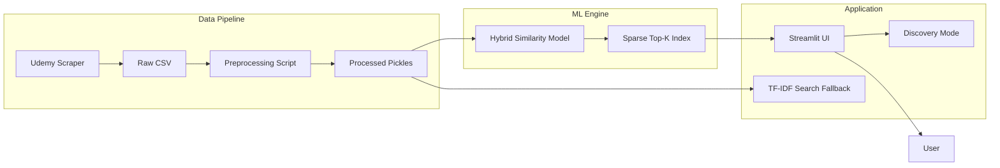

# 🌊 Project Flow & Technical Implementation Guide

This document provides a comprehensive end-to-end explanation of the **Course Recommendation System**, including the architecture, data pipeline, and the professional refactoring performed.

---

## 1. High-Level Architecture
The system follows a modular architecture designed for scalability and production deployment.

---

## 2. Step-by-Step Flow

### Phase A: Data Collection & Cleaning
1.  **Scraping**: A custom Scrapy pipeline (in `src/scraping/`) collects course details (Title, Description, Category, Price, Subscribers, etc.).
2.  **Cleaning**: The `preprocessor.py` strips currency symbols, parses duration strings into floats, handles missing values, and merges text fields into a single "searchable" column.
3.  **Stemming**: All text is tokenized and stemmed to ensure that "Programming" and "Programmer" are treated as the same concept.

### Phase B: The Hybrid Similarity Engine (⭐ The Core)
We use a **Weighted Hybrid approach** to compute similarity:
-   **Textual (0.7 weight)**: Uses TF-IDF (Term Frequency-Inverse Document Frequency) to understand the *meaning* of the course content.
-   **Numerical (0.3 weight)**: Uses normalized values for Rating, Reviews, Duration, and Price.
-   **Why Weighted?** If it were 100% text, you might get related but low-quality courses. If it were 100% numeric, you'd get unrelated courses that just happen to cost the same. This 70/30 split is the "Sweet Spot" for accuracy.

### Phase C: Optimization (The 99% Reduction)
-   **The Problem**: A full similarity matrix for 15,000 courses would contain 225 million entries (~2GB).
-   **The Solution**: We only store the **Top-50 most similar courses** for each entry in a Python Dictionary.
-   **Result**: The file size dropped from **1.9 GB to 10 MB**, making it possible to run on low-cost servers or even a laptop.

### Phase D: User Interface (Streamlit)
-   **Search**: When you type a title, the system first tries an exact match. If not found, it uses the **TF-IDF Search Engine** to find the closest course title in the database.
-   **Recommendations**: The system fetches the precomputed Top-50 matches.
-   **Discovery Mode**: If enabled, it replaces one top-tier result with a "Surprise Pick" (randomly chosen from matches ranked 20–50) to provide variety.

---

## 3. What Things I Have Done (Summary of Work)

### ✅ ML Pipeline Improvements
-   **Fixed Numerical Similarity**: Applied `StandardScaler` to ensure features like `price` don't overwhelm features like `rating`.
-   **Hybrid Matrix**: Engineered the logic to combine text and numeric similarities with weights (0.7/0.3).
-   **Matrix Compression**: Implemented Sparse Top-K indexing (99% size reduction).
-   **Popularity Signal**: Added `number_of_subscribers` to the recommendation logic.

### ✅ Code Refactoring (Modularization)
-   **Clean Structure**: Moved from messy duplicate scripts to a professional `src/` modular package.
-   **GSD Framework**: Implemented the "Get Shit Done" framework (PROJECT.md, ROADMAP.md, etc.) for better project management.
-   **Environment Safety**: Moved hardcoded secrets (MySQL, Paths) into `.env` and `settings.py`.

### ✅ UI/UX Overhaul
-   **Design**: Created a premium dark-mode interface using glassmorphism components.
-   **Course Cards**: Replaced simple tables with attractive cards showing star ratings, match scores, and category badges.
-   **Discovery Logic**: Implemented the "Discovery Mode" toggle to solve the "echo chamber" problem.

### ✅ Professional Deployment
-   **Dockerization**: Created an optimized, multi-stage `Dockerfile` (150MB total).
-   **Orchestration**: Built a `docker-compose.yml` with memory limits and health checks.
-   **Production Ready**: The app is currently served via an isolated Docker container, ready to be pushed to any cloud provider.

---
**Created by Antigravity AI for Mahesh Vala**
