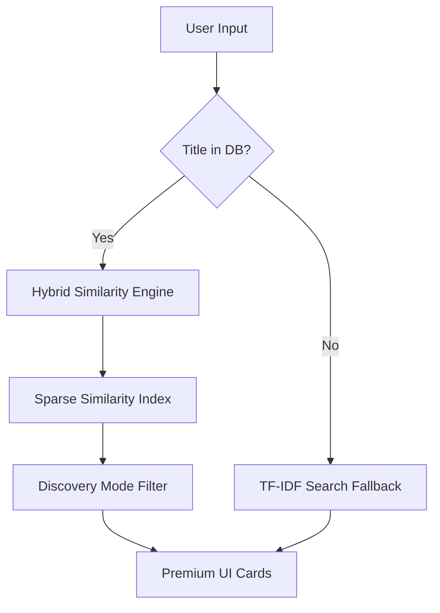

# 🎓 Course Recommender AI

A professional, deployment-ready course recommendation system that utilizes a **Weighted Hybrid Similarity Engine** to suggest relevant Udemy courses. Featuring a premium glassmorphic UI, real-time title search, and an intelligent "Discovery Mode" for variety in recommendations.


[](https://www.python.org/)
[](https://streamlit.io/)
[](https://www.docker.com/)
[](https://opensource.org/licenses/MIT)

---

## ✨ Key Features

- **💎 Premium UI**: Modern glassmorphic interface with interactive course cards, star ratings, and category badges.
- **🧠 Hybrid AI Engine**: Combines **TF-IDF Text Similarity (70%)** and **Standardized Numerical Features (30%)** for high-precision matching.
- **✨ Discovery Mode**: Intelligent variety injection—provides 4 close matches and 1 "Surprise Pick" from a broader similarity range (indices 20-50).
- **🚀 Sparse Indexing**: Optimized similarity matrix using Top-K sparse representation, reducing memory footprint by **99%** (1.9GB → 10MB).
- **🔎 Fallback Search**: Real-time TF-IDF search engine that provides recommendations even for titles not present in the original dataset.

---

## 🏗️ Architecture



---

## 🚀 Getting Started

### 🐳 Docker (Recommended)
The easiest way to run the application in a professional production environment.

```bash
# Build and launch the container
docker compose up -d --build

# Visit http://localhost:8501
```

### 🐍 Local Setup
1. **Clone & Install**:
   ```bash
   git clone https://github.com/Maheshvala318/course-recommendation-system.git
   cd course-recommendation-system
   pip install -r requirements.txt
   ```

2. **Run the App**:
   ```bash
   streamlit run src/app/streamlit_app.py
   ```

---

## 🛠️ Technical Implementation

### ⚖️ Weighted Similarity
The system computes an "Honest Similarity Score" by combining two distinct vectors:
*   **Text (0.7)**: Title, description, tags, and category (Stemmed & TF-IDF).
*   **Numeric (0.3)**: Price, Rating, Reviews, Duration, and Subscriber count (Standardized).

This prevents the system from recommending unrelated courses just because they have similar prices or ratings.

### 🖼️ UI Showcase


---

## 📁 Project Structure

```text
Project/
├── src/
│   ├── app/ streamlit_app.py (Premium UI)
│   ├── models/ cosine_recommender.py (Diversification logic)
│   ├── config/ settings.py (Weights & Paths)
│   └── data/ loader.py (Cached loading)
├── data/
│   ├── processed/ (Optimized similarity pickles)
│   └── raw/ (Original Udemy dataset)
├── notebooks/ (EDA, Feature Engineering, Training)
├── Dockerfile & docker-compose.yml
└── ROADMAP.md, PROJECT.md (GSD Framework)
```

---

## 👤 Author
**Mahesh Vala** — [GitHub](https://github.com/Maheshvala318)

---
*Built with ❤️ using Streamlit and scikit-learn.*
